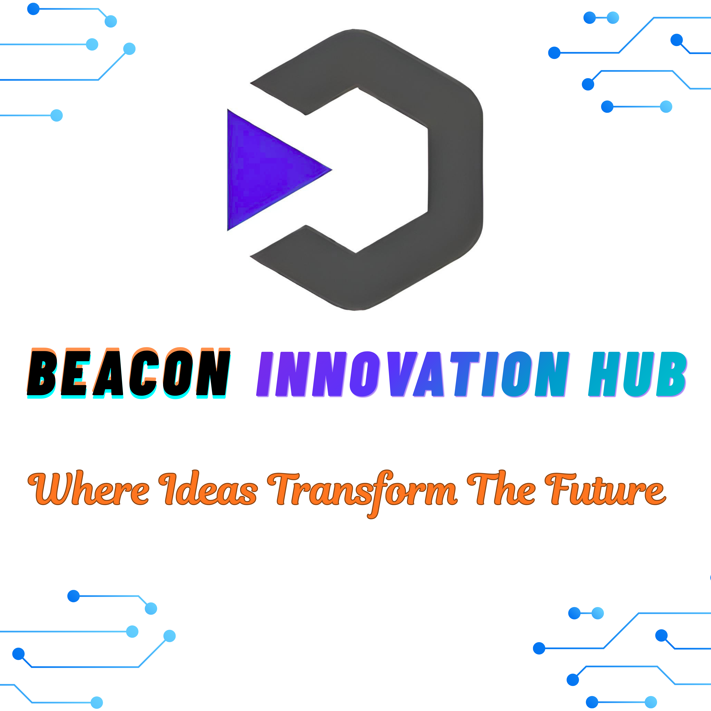

<div align="center">

# Beacon Innovation Hub

### A Beacon for Innovators Building for the Future

**Learn • Build • Collaborate • Innovate**

[Website](https://beaconinnovationhub.co.za/) • [LinkedIn](https://www.linkedin.com/company/beacon-innovation-hub/) • [Learning Resources](https://github.com/Beacon-Innovation-Hub/LEARNING-RESOURCES)

</div>

---

## About Beacon Innovation Hub

Beacon Innovation Hub (BIH) is a technology and innovation community where aspiring professionals develop practical skills through **structured learning, collaboration and real-world projects**.

BIH brings together people from different technical fields to learn, build solutions, share knowledge and gain experience working in collaborative environments.

Our goal is to move beyond theoretical learning and develop people who can **apply their knowledge to real problems**.

---

## Start Here

New to the BIH Community? Follow this pathway:

**Learn → Practice → Build → Collaborate → Review → Improve**

Start by exploring the BIH Learning Resources repository.

### [Explore BIH Learning Resources →](https://github.com/Beacon-Innovation-Hub/LEARNING-RESOURCES)

The repository contains structured resources, videos, documentation, practical activities and projects for both beginners and developing professionals.

---

## Learning Areas

| Field                         | Focus                                                 |
| ----------------------------- | ----------------------------------------------------- |
| **Software Development**      | Programming, web development and software engineering |
| **Data Analysis**             | Data preparation, SQL, analysis and visualization     |
| **Data Science**              | Python, statistics and machine learning               |
| **Data Engineering**          | Databases, ETL, pipelines and data infrastructure     |
| **Cybersecurity**             | Security analysis and secure development              |
| **Networks & Infrastructure** | Networking, cloud and infrastructure                  |
| **Research & Innovation**     | Research, feasibility and technical investigation     |

Participants can begin with foundational learning before progressing toward practical projects and competence-based activities.

---

## How BIH Projects Work

BIH uses GitHub to introduce participants to collaborative workflows used in professional technology environments.

```text
Problem / Opportunity
        ↓
Research & Planning
        ↓
Development
        ↓
Feature Branch
        ↓
Pull Request
        ↓
Technical Review
        ↓
Security / Data / Project Review
        ↓
BIH Approval
        ↓
Merge & Implementation
```

Contributors work through branches and pull requests so that work can be reviewed before it is integrated into the main project.

---

## Our Technical Community

BIH brings together participants across several disciplines:

* **Software Development** — Designing and building software solutions.
* **Data** — Data analysis, data science and data engineering.
* **Cybersecurity** — Assessing systems and improving security.
* **Networks & Infrastructure** — Networking, cloud and digital infrastructure.
* **Research & Innovation** — Investigating problems, opportunities and potential solutions.

This multidisciplinary structure allows members to collaborate on projects that require different areas of expertise.

---

## What We Develop

BIH focuses on developing:

* Technical competence
* Practical project experience
* Problem-solving skills
* Professional GitHub portfolios
* Teamwork and collaboration
* Technical documentation
* Security awareness
* Research and analytical skills
* Professional readiness

> **Learning is only the beginning. The goal is to demonstrate competence by applying knowledge.**

---

## Contributing

BIH members are encouraged to learn, experiment, contribute to projects and participate in technical reviews.

GitHub **Issues, Branches, Commits, Pull Requests and Reviews** form part of the collaboration process.

```text
Learn → Practice → Build → Review → Improve → Deliver
```

---

<div align="center">

## Start Building With BIH

**[Explore the Learning Resources](https://github.com/Beacon-Innovation-Hub/LEARNING-RESOURCES)**

[Website](https://beaconinnovationhub.co.za/) • [LinkedIn](https://www.linkedin.com/company/beacon-innovation-hub/)

**Beacon Innovation Hub**

*A Beacon for Innovators Building for the Future.*

</div>

<p align="center">
  
</p>
